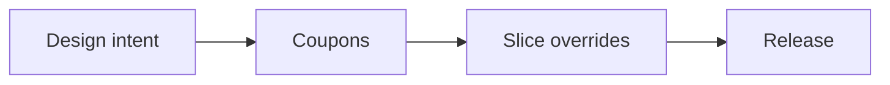

# Metricraft Docs Style Guide

**version:** 0.1.0
**status:** draft
**applies to:** everything under `/docs` in `https://github.com/aaronmeza/metricraft`

---

## TL;DR rules

* Write **concise, technical, remix‑friendly** docs. Prefer clarity over flourish.
* Use **US English**, **active voice**, and **present tense** for procedures.
* Filenames use **all‑lowercase‑hyphens**. Versions follow **semver**.
* Keep one clear **purpose per file**. If a page needs two H1s, split it.
* Prefer **relative links** inside the repo. Avoid bare URLs; use `[label](url)`.
* Use **semantic line breaks** (short lines per clause) for diff‑friendly reviews.
* Default units: **SI (mm, g, °C)**. Add imperial equivalents only when helpful.
* Add new terms to `/docs/glossary.md` and keep terminology consistent.
* Every part release includes a **README**, **test coupons**, **slicing notes**, and a **changelog**.

---

## Voice & tone

* **Direct, reader‑first.** Explain *what*, *why*, then *how*.
* **No purple prose.** Keep sentences short. Define acronyms on first use.
* **Inclusive language.** Use gender‑neutral terms; avoid idioms that don’t translate.
* **Precision > vibe.** If a claim is fuzzy, add numbers, ranges, or references.

---

## File & folder conventions

* **Filenames:** `all-lowercase-hyphens.md` (e.g., `bambu-ams-setup.md`).
* **Paths inside `/docs`:**

  * `/docs/style-guide.md` – this file
  * `/docs/glossary.md` – shared terms and definitions
  * `/docs/decisions/` – architectural/decision records (ADRs)
  * `/docs/templates/` – issue/PR/release/README templates
  * `/docs/assets/` – images/diagrams; subfolders per topic (`/assets/datum-rail/`)
* **ADRs (decision records):** `/docs/decisions/YYYY-MM-DD-short-slug.md`

```text
Example: /docs/decisions/2025-08-14-ams-2-pro-drying-material.md
```

---

## Markdown style

* **Headings:** Sentence case. One `#` H1 per file; start content with a short intro.
* **Lists:** Use `-` for unordered, `1.` for ordered. Keep items to one idea each.
* **Code blocks:** Triple backticks with language hint: `bash`, `json`, `scad`.
* **Callouts:** Use blockquotes with a bold label.

> **Note:** PETG is preferred for heat‑exposed parts; see material section.

* **Tables:** Use sparingly. Keep < 80 characters per cell; break wide tables into sections.
* **Links:** Relative for repo docs (`../glossary.md`). External links require a short rationale.
* **Images:** Place under `/docs/assets/<topic>/`. Use alt text; prefer SVG for diagrams.
* **Diagrams:** Use Mermaid when a diagram clarifies intent.



* **Line breaks:** Semantic line breaks (one clause per line) to make diffs readable.

---

## Terminology

* Project: Metricraft (capitalized).
* **Tokens:** Inline‑code format for tunables, e.g., `mc-rail-12`, `mc-dovetail-8`, `t12`.
* **Filament naming:** Prefix with brand when relevant (e.g., *Bambu PETG‑Translucent*).
* Log new or changed terms in `/docs/glossary.md`.

---

## Numbers, units, and notation

* Use **SI units** by default: `mm`, `g`, `°C`. Put unit immediately after the value with no extra space except for `°C`.
* Use **non‑breaking spaces** in rendered outputs where supported (e.g., `60 °C`).
* For ranges, use an en dash: `0.20–0.28 mm`.
* Dimensions use **L × W × H** ordering unless otherwise noted.

---

## Versioning & changelogs

* Docs reference component versions using **semver** (e.g., `v1.2.3`).
* Maintain a part‑level `CHANGELOG.md` or a section at the end of the README using *Keep a Changelog* style.
* Tag releases in Git with the same semver string.

**Changelog snippet**

```markdown
## [1.2.0] – 2025‑08‑14
Added
- New acceptance criteria for XY clearance ladder.
Changed
- PETG slice defaults for AMS 2 Pro drying.
```

---

## Decision records (ADRs)

Each significant choice gets an ADR.

**Template**

```markdown
# Title (short, decision‑shaped)

**Date:** YYYY‑MM‑DD  
**Status:** Proposed | Accepted | Superseded by <ADR#>  
**Context**  
Why this decision is needed; relevant constraints and options considered.

**Decision**  
The decision in one crisp paragraph.

**Consequences**  
Trade‑offs, risks, follow‑ups, migration notes.

**References**  
Links to PRs, issues, experiments, or external sources.
```

---

## 3D‑printing releases (README pattern)

Each released part/assembly must ship with a concise, remix‑friendly README.

**README skeleton**

```markdown
# <part‑name> <version>

**what:** One‑sentence purpose.  
**why:** Problem it solves and design intent.  
**printer/filament:** Bambu P1S + AMS/AMS 2 Pro; Bambu filaments.  
**defaults:** Bambu Studio 2.2.0.85 unless stated.

## test coupons
- XY clearance ladder: target fit = <spec>; acceptable range = <spec>.
- Hole/shaft gauges: nominal ± clearance; report measured outcomes.
- Snap‑fit cantilever: report deflection and latch integrity per filament.

## slicing
**goal:** strength | translucency | surface.  
**defaults:** layer 0.20 mm; walls 3; infill 15% grid.  
**overrides:** list only what deviates; explain why.

## tolerances
- Initial XY clearance: 0.15 mm (PETG); Z top/bottom: 0.10 mm.  
- Calibrate with provided coupons; adjust per filament.

## seam & overhang notes
- Keep seam off show faces; mark keep‑outs in model images.  
- Overhangs >50° require supports; call out risk zones.

## safety & license
- Hot‑end/AMS proximity notes if heat‑adjacent.  
- License(s): see repo /docs/LICENSE or project‑specific license.

## changelog
- See CHANGELOG below or linked file.
```

---

## MakerWorld publishing checklist

* ✅ Title, tags, and a terse description that states **what/why** before **how**.
* ✅ Upload **STL** and a **Bambu 3MF** with:

  * Named objects, accurate plate names, and a compact **README** object/text.
* ✅ Include **coupon plates** with acceptance criteria.
* ✅ Provide **slicing overrides** inline in 3MF + summarized in README.
* ✅ License and remix policy clearly stated.
* ✅ Hero image: neutral background, 3/4 angle, seam hidden; include a coupon close‑up.

---

## Contribution guidelines (docs‑specific)

* Prefer small PRs scoped to a single page or section.
* Start each PR description with **Intent**, **Scope**, **Out‑of‑scope**.
* In reviews, cite line numbers and suggest concrete rewrites.
* Squash‑merge with a conventional commit, e.g., `docs(readme): add PETG coupon notes`.

---

## Licensing (docs vs. models)

**Docs**  
All content under `/docs` is licensed **CC BY 4.0**. See `/docs/LICENSE`.

**Models & print assets**
STL/3MF files and product photos/renders are **not** covered by `/docs/LICENSE`.
Default stance: **Remixes allowed / Non-Commercial**, unless overridden in the model README or adjacent `LICENSE`.


**Code & scripts**
Code follows the repository’s root license unless a subfolder states otherwise.

**Publishing rule of thumb**  
- State the applicable license in each part README and match it on MakerWorld.  
- If a license changes (docs, models, or code), record the change in an ADR and the part CHANGELOG.

---

## Templates index

* `/docs/templates/readme.md`
* `/docs/templates/changelog.md`
* `/docs/templates/adr.md`
* `/docs/templates/release-checklist.md`

### Template locations
+Use **`docs/templates/`** for documentation templates (README, changelog, ADR, release checklist).  
+Use **`/templates/`** (repo root) for product/publishing artifacts (MakerWorld descriptions, RFQs, manufacturing briefs).
